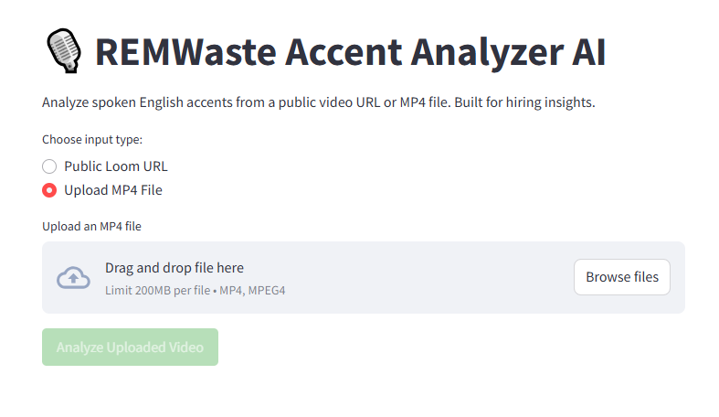
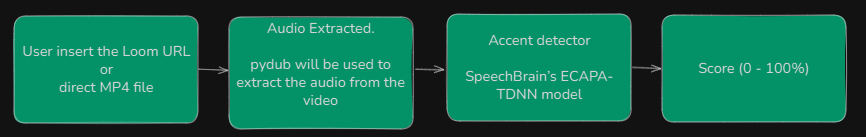

# 🎙️ English Accent Classifier App



An AI-powered web application built for **REM Waste** to evaluate spoken English by detecting accents from video input. It accepts a public video URL (Loom or direct MP4), extracts the audio, and classifies the speaker's accent using a state-of-the-art deep learning model.



---

## 📌 Challenge Objective

As part of a practical interview task for REM Waste, the goal was to:

- ✅ Accept a **public video URL** (e.g., Loom or MP4).
- ✅ **Extract the audio** from the video.
- ✅ **Detect the speaker's accent** and ensure it's an English-language accent.
- ✅ Provide:

  - 🎯 Classification of the accent (e.g., British, American, etc.)
  - 📈 Confidence score (0-100%)
  - 📝 Optional short explanation

---

## 🚀 Solution Overview

The solution is built with **Python** and uses **Streamlit** for a simple and interactive UI. The backend pipeline includes:

- **Audio extraction** via `pydub`
- **Preprocessing** (conversion, normalization)
- **Accent classification** using the **SpeechBrain ECAPA-TDNN** model from Hugging Face

---

## 🧠 Why ECAPA-TDNN?

After an in-depth analysis of community-trusted models, the **SpeechBrain ECAPA-TDNN** model was selected for its strong performance on the CommonAccent dataset.

### 🔬 Model Highlights

- Architecture: ECAPA-TDNN with statistical pooling
- Dataset: CommonAccent (English with 16 accents)
- Accuracy: **87%** on test set
- Source: [SpeechBrain Accent Classifier](https://github.com/JuanPZuluaga/accent-recog-slt2022)

### 🎧 Supported Accents

- african
- australia
- bermuda
- canada
- england
- hongkong
- indian
- ireland
- malaysia
- newzealand
- philippines
- scotland
- singapore
- southatlandtic
- us
- wales

> ⚠️ Note: Input speech is auto-normalized to 16kHz mono channel.

---

## 🧪 Other Considered Models

### ❌ HamzaSidhu786/speech-accent-detection

- Claims 99.5% accuracy (on VCTK dataset)
- Uses Wav2Vec2
- ⚠️ **Poor documentation**
- ⚠️ **Overstated performance**

Hence, **not used** in the final implementation.

---

## 🛠️ How to Run Locally

Follow these instructions to run the project on your machine.

### 🖥️ 1. Create a Virtual Environment

**Windows:**

```bash
python -m venv venv
```

**Linux/macOS:**

```bash
python3 -m venv venv
```

### ▶️ 2. Activate the Virtual Environment

**Windows:**

```bash
venv\Scripts\activate
```

**Linux/macOS:**

```bash
source venv/bin/activate
```

### 📦 3. Install Dependencies

**Universal:**

```bash
pip install -r requirements.txt
```

### 🔁 4. Run the Application

```bash
streamlit run app.py
```

### 🌐 5. Open in Browser

After the server starts, it will provide a local URL (e.g., [http://localhost:8501](http://localhost:8501)). Open it in your browser and test the tool with a public video URL.

---

## 🧹 File Cleanup

For this proof-of-concept version:

- 🎯 Temporary files are **automatically deleted** after processing.
- 📦 This helps keep the environment clean and prevents disk space issues.
- ☁️ Future versions may use cloud buckets for storage.

---

## 💡 Features

- 🧠 ECAPA-TDNN based classification
- 🗂️ Supports 16 English accents
- 📈 Confidence scoring
- 🚮 Auto-cleanup of test files
- 🖥️ Streamlit frontend for interactivity

---

## 📚 Citations

### 🔬 CommonAccent Research

```
@article{zuluaga2023commonaccent,
  title={CommonAccent: Exploring Large Acoustic Pretrained Models for Accent Classification Based on Common Voice},
  author={Zuluaga-Gomez, Juan and Ahmed, Sara and Visockas, Danielius and Subakan, Cem},
  journal={Interspeech 2023},
  url={https://arxiv.org/abs/2305.18283},
  year={2023}
}
```

### 🔬 ECAPA-TDNN Model

```
@inproceedings{ecapatdnn2020,
  author    = {Brecht Desplanques and Jenthe Thienpondt and Kris Demuynck},
  title     = {{ECAPA-TDNN:} Emphasized Channel Attention, Propagation and Aggregation in TDNN Based Speaker Verification},
  booktitle = {Interspeech 2020},
  pages     = {3830--3834},
  year      = {2020}
}
```

### 🔬 SpeechBrain Toolkit

```
@misc{speechbrain,
  title={{SpeechBrain}: A General-Purpose Speech Toolkit},
  author={Mirco Ravanelli and et al.},
  year={2021},
  eprint={2106.04624},
  archivePrefix={arXiv},
  primaryClass={eess.AS}
}
```

---

## 👋 Contribution & Contact

Feel free to explore and modify the code for your needs. For feedback, collaboration, or support, feel free to reach out via LinkedIn or GitHub.

Happy building!
